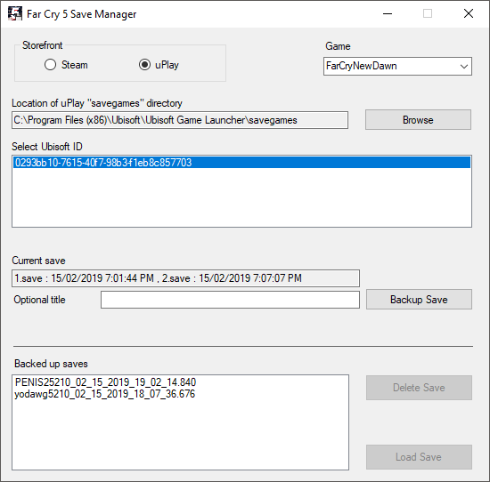

# FarCry5SaveManager

A program to backup and manage multiple Far Cry 5 savegames on Windows.

Written in C# using Visual Studio 2015.
  
  
 
### Requirements

At least .Net Runtime 4.5, and possibly 4.6.1.

Windows 7 x64 or above.

  
### Use

Make your own backup of "C:\Program Files (x86)\Ubisoft\Ubisoft Game Launcher\savegames" or your equivalent uPlay savegames location before running.

Don't run the application while Far Cry 5 is running; it'll break stuff.

Steps to use:
1) Launch application

2) Select your Ubisoft Unique ID

3) Choose to backup the save in that location

4) Launch FC5

5) Start new game

6) Quit FC5

7) Back up the new save

Now, to restore

1) Click the Ubisoft ID you want to restore to

2) Click the save game you want to restore

3) Click the Load Save button... **WARNING**: This will overwrite your current save whether it's backed up or not 

Then...

Close application and run Far Cry 5.

 

### Build

<a href="https://github.com/kellybs1/FarCry5SaveManager/raw/master/Build/SetupFC5SM.msi">/Build/SetupFC5SM.msi</a>

Note: This is not a signed application. You may need to allow through antivirus software and Windows security.

If you don't understand the source code you probably shouldn't run unsigned software.

### Source

<a href="/FarCry5SaveManager">/Source</a>

### Screenshots

### Important Notes / Legal

Is buggy.

Can delete files.

May break stuff on your PC.

Not my fault, back your stuff up.

